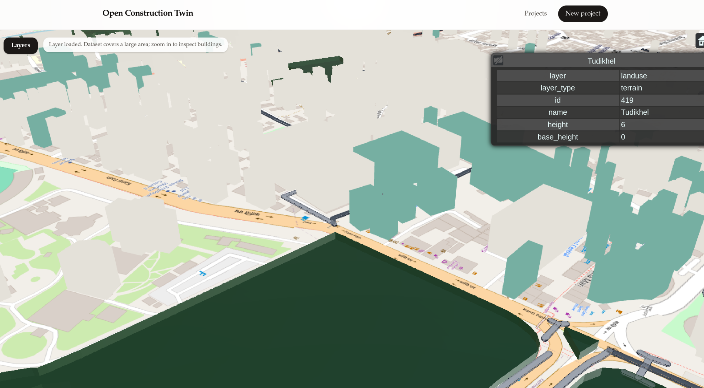
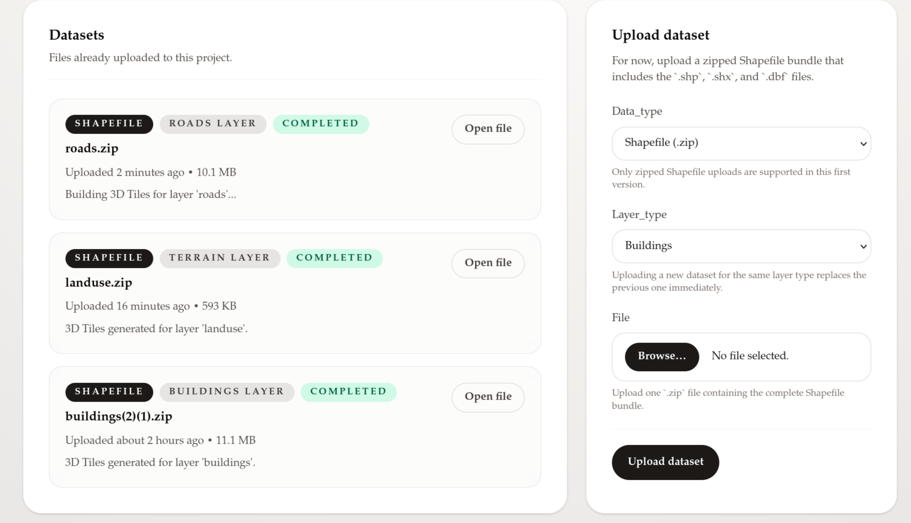

# Construction Twin

Construction Twin is a Rails-based 3D geospatial pipeline that lets you upload GIS datasets (currently zipped Shapefiles), process them into PostGIS, convert them into 3D Tiles, and visualize them in a Cesium viewer.

## Screenshots

### 3D map viewer



### Project dataset details page



## What Is Implemented

### Core application

- Project management (create, edit, view, delete projects)
- Dataset upload workflow per project
- Dataset status tracking (`uploaded`, `processing`, `completed`, `failed`)
- Layer model with visibility toggle and processing states (`pending`, `processing`, `ready`, `failed`)

### Supported data and layer types

- Input format: zipped Shapefile (`.zip` containing `.shp`, `.shx`, `.dbf`, and related files)
- Layer types: `buildings`, `terrain`, and `roads`
- One active dataset per layer type per project (new upload replaces previous dataset for that layer type)

### Processing and export pipeline

- Async processing with Solid Queue jobs:
  - `ProcessDatasetJob`: validates and imports shapefile content using `ogr2ogr`
  - `Generate3dTilesJob`: exports processed geometries to 3D Tiles
- Geometry normalization into PostGIS feature tables (`buildings`, `terrains`, `roads`)
- Default extrusion heights when source height values are missing:
  - Buildings: `28m`
  - Terrain: `6m`
  - Roads: `1m`
- 3D Tiles conversion through Dockerized `geodan/pg2b3dm`
- Versioned tileset artifacts stored under `public/tilesets/projects/:project_id/layers/:layer_id/revisions/:timestamp`

### Viewer and APIs

- Cesium full-screen map viewer
- Layer panel with visibility toggles persisted through API
- Automatic rendering preference:
  - 3D Tiles when available
  - GeoJSON fallback when tiles are unavailable or not visible
- Layer metadata and features endpoints:
  - `GET /projects/:project_id/layers`
  - `PATCH /projects/:project_id/layers/:id`
  - `GET /projects/:project_id/layers/:id/features`

## Roadmap

The following items are planned next (not fully implemented yet):

1. Additional input formats (GeoJSON, GeoPackage, IFC, CityGML)
2. Better upload and processing UX (progress indicators, retries, cancellation)
3. Stronger data validation and QA (CRS checks, geometry repair reports, per-layer diagnostics)
4. Advanced styling controls (material presets, thematic coloring, metadata-driven styling)
5. Collaboration features (annotations, issue pins, shared views)
6. Production hardening (observability, audit logs, background job scaling, automated backups)

## Local Setup

### 1) Prerequisites

Install these tools first:

- Ruby
- Bundler
- Node.js
- Yarn
- Docker + Docker Compose
- GDAL/OGR tools (`ogr2ogr` must be available on your PATH)

### 2) Install dependencies

```bash
bundle install
yarn install
```

### 3) Pull the 3D converter image

```bash
docker pull geodan/pg2b3dm:latest
```

Optional runtime overrides:

```bash
export PG2B3DM_DOCKER_IMAGE=geodan/pg2b3dm:latest
export PG2B3DM_DOCKER_NETWORK=host
```

### 4) Start PostGIS database

```bash
docker compose up -d db
```

Default development database env values:

- `DB_HOST=127.0.0.1`
- `DB_PORT=55432`
- `DB_USER=postgres`
- `DB_PASSWORD=postgres`
- `DB_NAME=open_construction_twin_development`
- `DB_QUEUE_NAME=construction_twin_development_queue`
- `DB_TEST_NAME=construction_twin_test`

### 5) Prepare databases

```bash
bin/rails db:prepare
```

This sets up both the primary and queue databases.

### 6) Build app assets

```bash
yarn build:all
```

This builds JavaScript and copies Cesium static assets to `public/cesium`.

### 7) Run the app

```bash
bin/dev
```

`bin/dev` starts:

- Rails web server
- Solid Queue worker (`bin/jobs start`)
- JavaScript watcher
- Tailwind/CSS watcher

Open `http://localhost:3000`.

## Environment and Spatial Extensions

- PostGIS is required.
- `postgis_sfcgal` is also required for full 3D extrusion behavior.
- Spatial extension setup is enforced by migrations in `db/migrate`.

## Quick Verification

After setup, you can verify the flow in minutes:

1. Create a project from the home page.
2. Upload a zipped Shapefile dataset and choose layer type.
3. Wait for status transitions in the dataset card.
4. Open 3D viewer and toggle the processed layer.
5. Confirm `GET /projects/:project_id/layers` returns ready artifact URLs.
